# PLM — PlayList Manager

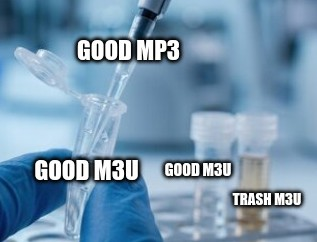
 
A fzf + tmux wrapper in bash := terminal front-end (TUI) for managing a **m3u-based music library** that is played by a headless [qmmp](https://qmmp.ylsoftware.com/). One track plays, PLM shows you every playlist that track appears in, and you move / copy / trash it without leaving the keyboard.

No build, no runtime: the package is a set of Bash files you `source`,

No database management is necessary (phew) EXCEPT if you want to use `PlayArtist` (play all songs from an artist) in which case a database creation is the only way - done with a Python script for the tag index generation.

> [!TIP]
> **Who this is for:** \
> You keep a local library of music (mp3s). \
> You don't believe in genres - You don't think default assigned genres are correct - You like to play multiple genres mixed in a session - You sometimes play `Jazz` but also sometimes play just `Bigband Jazz` but also sometimes play `Bossa Nova` with `Minimalist Piano`, etc. \
> You can't find a playlist manager which does not include manually clicking dragging each file into each playlist. \
> You play music as you do something else - and think *man this track does not belong here. Now I have to click on the music player, click on the track and drag it to where i want, or no maybe i can press options and add to another playlist - wait I have 50+ playlist where even is `Ghibli Covers`* ... 
> > You get the point

```
PL                        tmux session
├── top pane      PLM_monitorer.sh   1 Hz `qmmp --status` + action log
└── bottom pane   PLayList           pick playlist(s) → play → manage
                  └── PLManager      one fzf screen per track
```

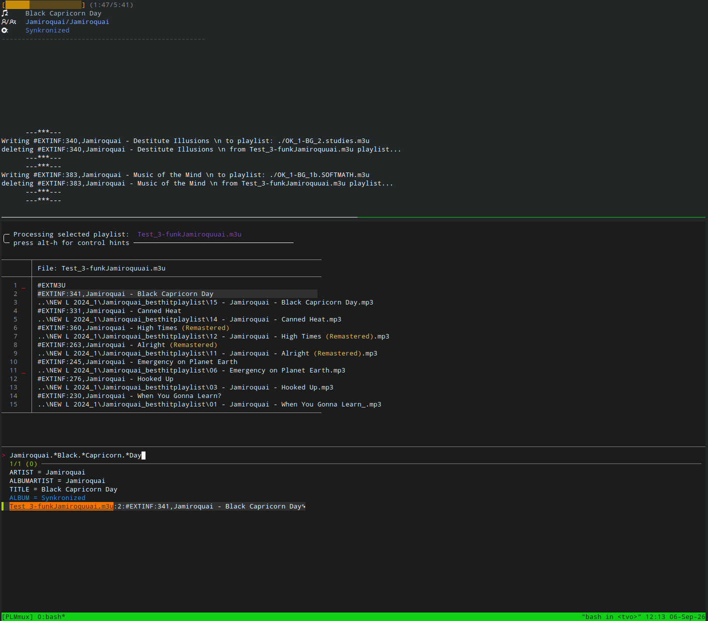
*`PL`: qmmp status and the action log on top, the track manager below.*

---

## 1. Requirements

| Tool | Used for | Minimum |
|---|---|---|
| `qmmp` | the player itself, driven only through its CLI | **2.x** (built from source, see below) |
| `fzf` | every interactive screen | ≥ 0.38 (`become(…)` bindings) |
| `ripgrep` (`rg`) | searching playlists | any |
| `bat` (`batcat`) | preview pane | any |
| `tmux` | the two-pane UI | any |
| `id3v2` | the `ctrl-e` tag editor | any |
| `python3` + `mutagen` | `PLM_indexer.py` tag index (only `PlayArtist` needs it) | any |
| `psmisc` | `killall qmmp` on quit | any |

### Dependencies installation

- Everything except qmmp

```bash
sudo apt install -y fzf ripgrep bat tmux id3v2 python3-mutagen psmisc git
```

Alternatively, `python3 -m pip install mutagen`.

- qmmp: Developed and tested against **2.3.0** 

Compile newer versions for headless-only controls. 


```bash
sudo apt install -y build-essential cmake pkg-config \
    qt6-base-dev qt6-tools-dev qt6-tools-dev-tools \
    libtag1-dev libmad0-dev libvorbis-dev libogg-dev libcurl4-openssl-dev \
    libasound2-dev libmpg123-dev libflac-dev

curl -LO https://qmmp.ylsoftware.com/files/qmmp/2.3/qmmp-2.3.0.tar.bz2
tar xf qmmp-2.3.0.tar.bz2 && cd qmmp-2.3.0
cmake . -DCMAKE_BUILD_TYPE=Release && make -j"$(nproc)" && sudo make install
sudo ldconfig

qmmp --version     # expect: QMMP version: 2.3.0
```

---

## 2. Installation

bash script wrappers, just source it 4Head.

```bash
git clone <this-repo> ~/shelltools/PLM
# check PLM_env:{$PLM_Library_Folder} to point to the correct library
echo 'source ~/shelltools/PLM/PLM' >> ~/.bashrc
exec bash
```

### Library layout

Point `PLM_Library_Folder` at your audio and `PLM_PlayLists_Folder` at the m3u folder
(see [Configuration](#5-configuration)); the trash folder is a **sibling of the playlists
folder**:

```
$PLM_Library_Folder/            # audio files, any tree you like
├── playlists/            # $PLM_PlayLists_Folder 
│   ├── OK_*.m3u                # stable — the only move/copy destinations
│   ├── Test_*.m3u              # staging: moving OUT of these deletes the source entry
│   ├── rm.m3u                  # trash sentinel, auto-created if missing
│   └── new.m3u                 # (virtual (file))
└── .trash/                     # $PLM_TRASH_FOLDER
    └── rm.log                  # $PLM_TRASH_LOG — what RestoreEntry reads back
```

Fresh setup:

```bash
PLSetLibrary [path]    # point to where the library is
PLInit                 # only create files if missing
PLMBuildIndex          # tag index, only needed for PlayArtist 
PL                     # PlayList - start playing and managing 1 m3u or multiple m3us
```


---

## 3. Controls

### Commands

Relevant commands exposed to bash env, that you may actually use

| Command | What it does |
|---|---|
| `PLSetLibrary [path]` | re-point the library root; write the corresponding env variable |
| `PLInit` | creates `playlists/`, `.trash/`, `rm.log` and `rm.m3u` inside the library folder |
| `PL` | the default player + manager |
| `PlayTrack [query]` | fzf over every mp3 in the library → tmp playlist → normal management loop |
| `PlayArtist [query]` | pick one track, play everything by that artist. Require an index built by `PLMBuildIndex`  |
| `PLMBuildIndex` | rebuild the tag index. |
| `PLMTrashAllEntries <playlist>` | bulk-trash (move to trash folder) every entry in one m3u |
| `RestoreEntry` | pick a file out of `.trash` and put it back |


### Track manager — `PLManager` (the main screen)

> Screenshots: [Search results](#4-screenshots), [Multi-select](#4-screenshots), [Reselect](#4-screenshots).

Opens fresh for each track, pre-queried with the playing artist + title, and lists every m3u entry that matches. Colored according to the character of the playlist (`Test` or  `OK` (stable ) )


| Key | Action |
|---|---|
| type | re-search all playlists (query is a regex) |
| `Tab` | mark several hits as destination m3us |
| `Enter` | **auto**: prompts for a ( m3u )destination - If current playlist is a `Test_*` playlist then *moves* the entry to destination, otherwise does a *copy* |
| `ctrl-x` | **move**: prompts for a destination, writes the entry there, deletes it from the source |
| `ctrl-c` | **copy**: prompts for a destination, source untouched |
| `ctrl-d` | remove the entry from this playlist only — **the audio file is not touched** |
| `ctrl-e` | edit TITLE / ARTIST / ALBUM tags of the highlighted track |
| `ctrl-r` | reselect: pick and play a different playlist |
| `alt-n` / `alt-b` | play next / previous track |
| `alt-space` | pause / unpause (`qmmp --play-pause`) |
| `alt-E` (shift-alt-e) | reveal the audio file in the graphical file manager |
| `ctrl-q` | quit everything |
| `alt-h` | toggle the key-hints sidebar (see below) |
| `Esc` | refresh management (See below) |
| `ctrl-g` | TBD |

Refreshing management of a file (`Esc`) exist because managing actions for a file do not terminate when the song is finished playing (prevent incomplete management actions). Hence, if another song is played, press `Esc` to start managing the currently playing song.

These controls are shared for `PlayArtist` and `PlayTrack` also.

### Destination picker

| Key / row | Action |
|---|---|
| `Tab` | write to several playlists at once |
| `Enter` | confirm |
| `rm.m3u` | **trash**: the audio file is moved to `.trash/`, the entry is logged in `rm.log` and removed from the source |
| `new.m3u` | **create**: prompts for a name (pre-filled `OK_`, `.m3u` appended if you leave it off), writes the `#EXTM3U` header, then uses the new playlist as the destination |
| `Esc` | cancel the whole action |

Only `OK_*` playlists are offered as real destinations.

### Tag editor — `ctrl-e`

> Screenshot: [Tag editor](#4-screenshots).

Opens `$PLM_EDITOR` (`$EDITOR` on your system, or fallback to `nvim`) on three metadata entries. Save and quit and the values are written back to the mp3 with `id3v2`; the file path itself is untouched.

---

## 4. Screenshots


<details>
<summary><b>Search results</b> — every playlist holding the current track</summary>

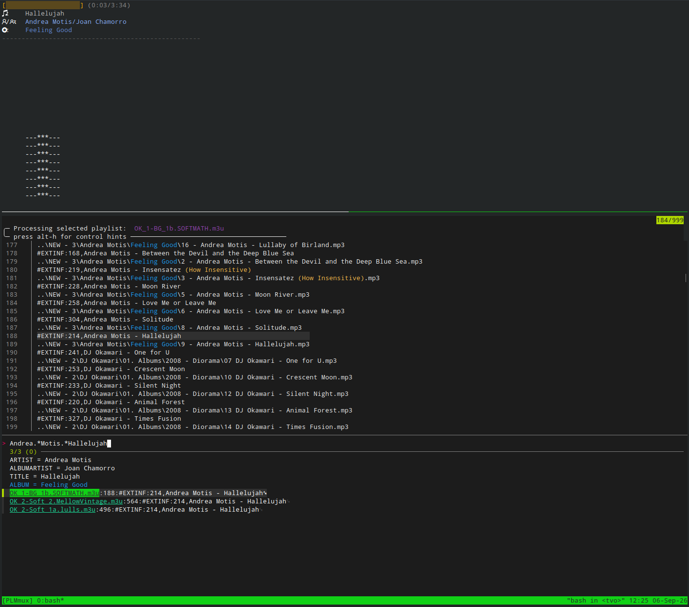

*The source playlist first, then `Test` playlists, then other playlists.*

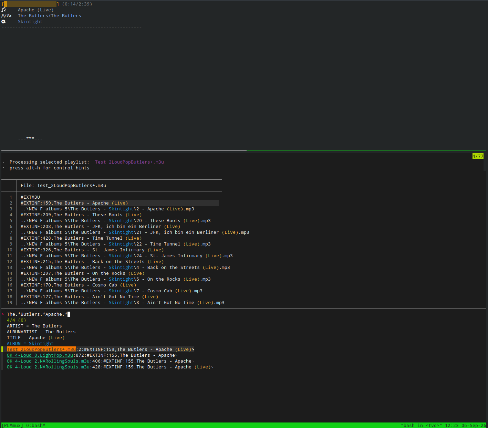

*Album and parentheses are highlighted, help differentiating between different versions of a song - single, live, remix, etc. *

</details>

<details>
<summary><b>Multi-select</b> — mark multiple (source entries or destination m3us), act on them at once</summary>

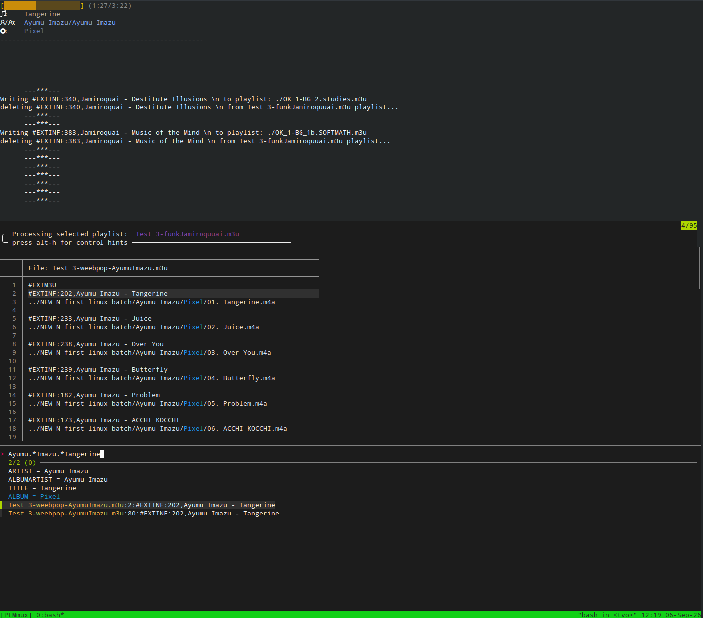

*1 — select an (or multiple) entry for cut or copy*

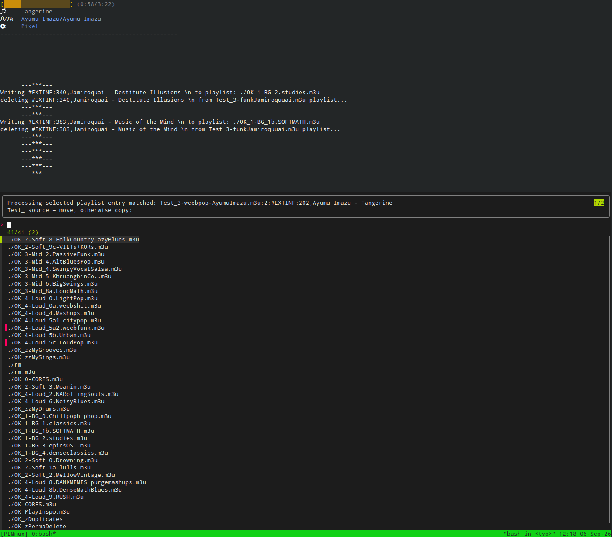

*2 — choose (1 or) multiple destination playlists. Because the entry selected is in a `Test` playlist, it gets cut from the source playlist and appended to destinations*

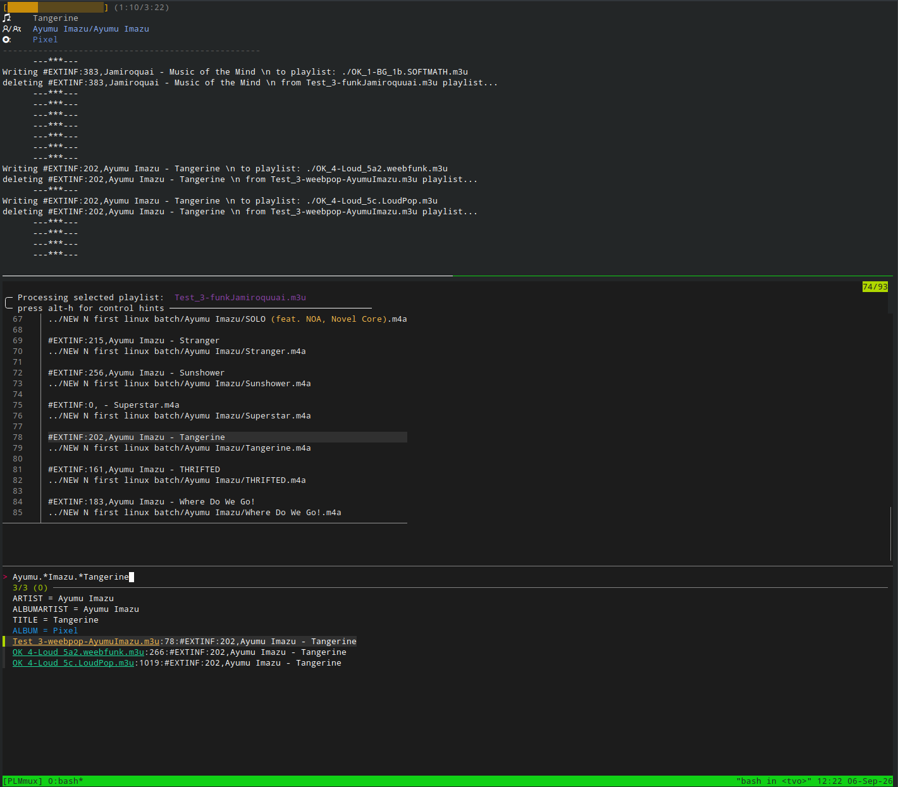

*3 — Result: Track in multple destinations*

</details>

<details>
<summary><b>(Re)select Playlists</b> </summary>

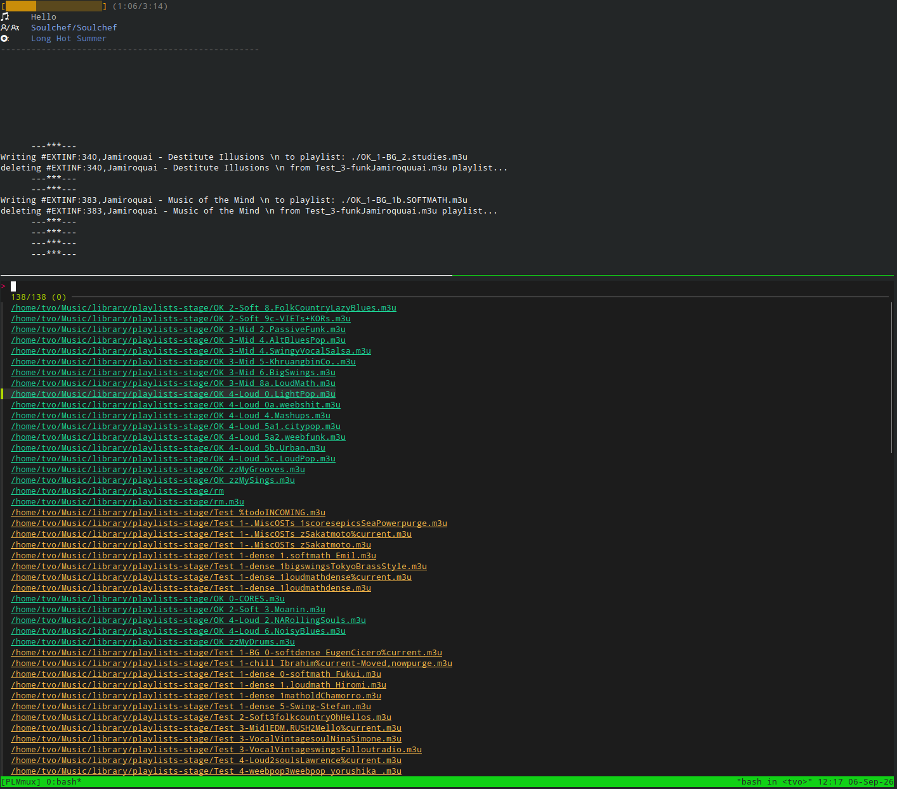

*Selecting from available playlists to play. Coloring based on the character of the playlists - `Test` or `OK`*

</details>

<details>
<summary><b>Tag editor</b> — <code>ctrl-e</code></summary>

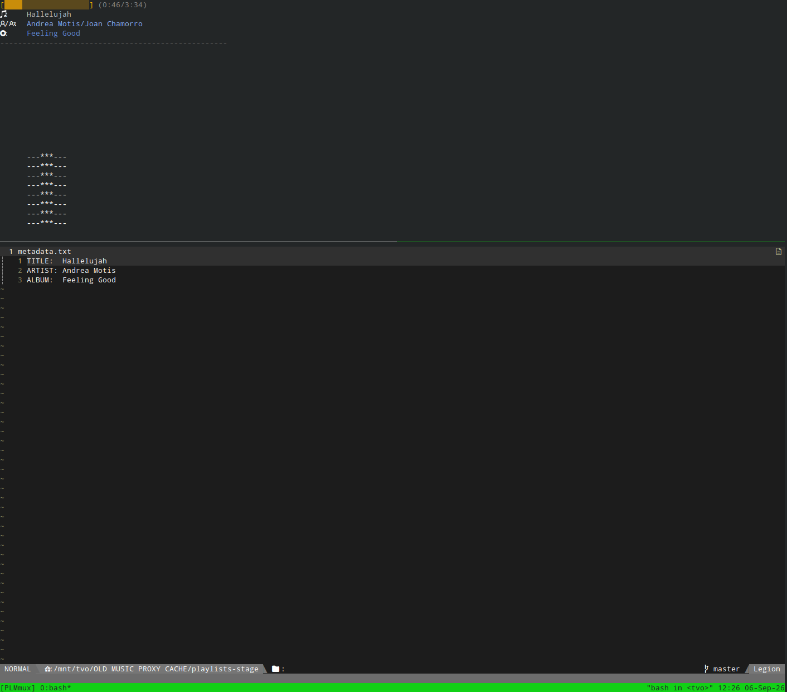

*Edit mp3 metadata of currently managing track with `id3v2`.*

</details>

<details>
<summary><b>PlayArtist</b> — Play everything from artist</summary>

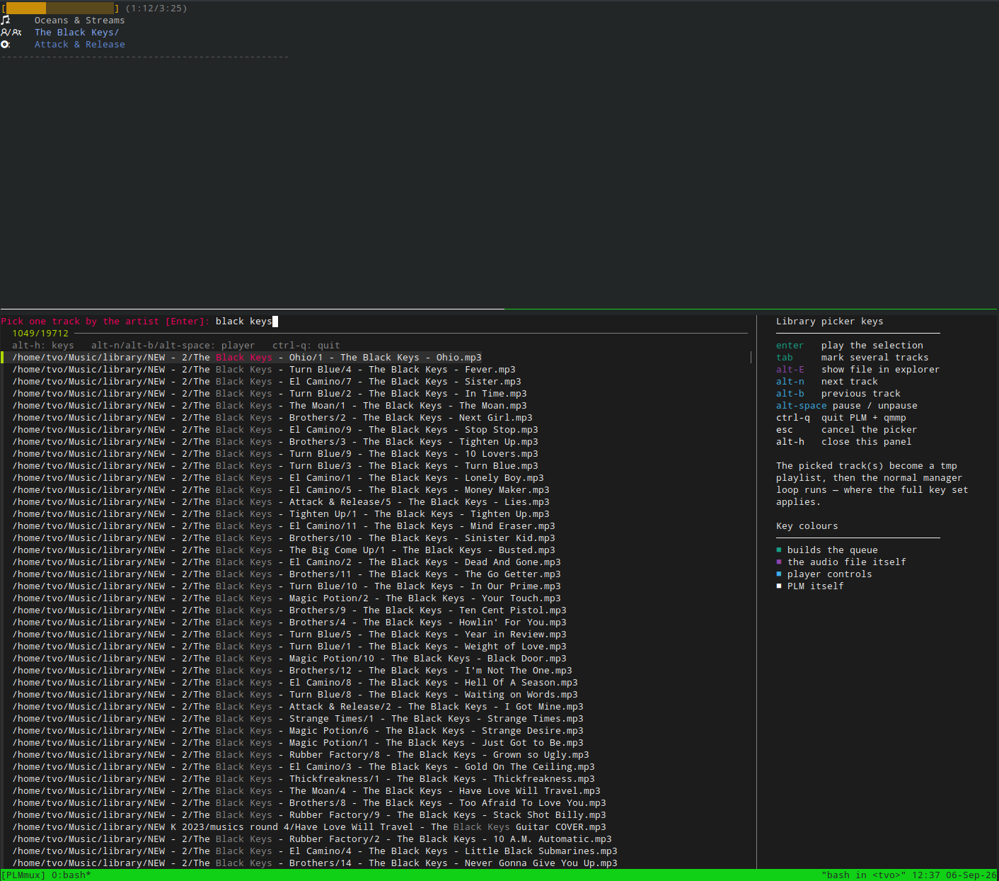

*1 — pick one track belonging to the artist.*

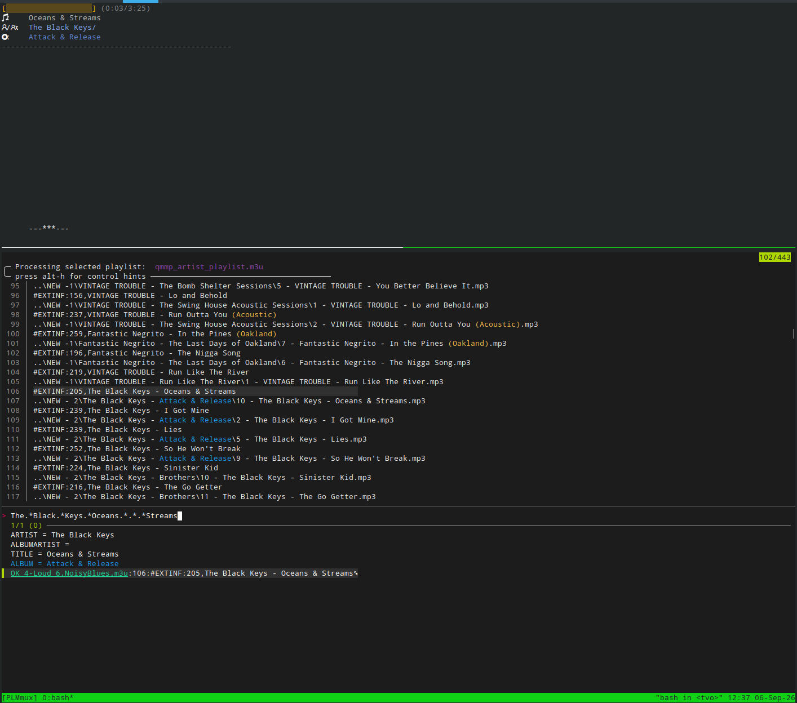

*2 — everything by that artist appended to a tmp playlist and played.*

</details>

---

## 5. Configuration

Some important variables that may be relevant for your own env

| Variable | Default | Meaning |
|---|---|---|
| `PLM_PATH` | the folder `PLM` was sourced from | where the sibling scripts live (`PLM_tag_editor.sh`, `PLM_monitorer.sh`, `PLM_indexer.py`) |
| `PLM_Library_Folder` | `$HOME/Music/library` | where your audio library is.  |
| `PLM_MEDIA_ROOTS` | `/media /media/$USER /run/media/$USER /mnt` | TBD where `PLSetLibrary` looks for a removable library |
| `PLM_PlayLists_Folder_name` | `playlists` | m3u folder, relative to the library |
| `PLM_PlayLists_Folder` | `$PLM_Library_Folder/$PLM_PlayLists_Folder_name` | Location of the playlist file. Preferably subfolder of the library. |
| `PLM_AUDIO_EXTS` | `mp3 wav flac aac ogg m4a` | every extension the library and trash pickers accept |
| `PLM_FIXED_PLAYLIST_PREFIX` | `OK` | prefix of stable playlists   |
| `PLM_TEST_PLAYLIST_PREFIX` | `Test` | prefix of testing playlists. |
| `PLM_PLAYLIST_SEPARATOR` | `_` | what sits between prefix and name in a real filename. E.g. `OK_Jazz` |
| `PLM_TRASH_PLAYLIST` | `rm.m3u` | destination sentinel meaning "trash it" |
| `PLM_NEW_PLAYLIST` | `new.m3u` | destination sentinel meaning "make a new playlist" |
| `PLM_TRASH_LOG` | `rm.log` | trash journal `RestoreEntry` reads |
| `PLM_Ressurect_Playlist` | `Test_99_Resurrected.m3u` | restored entries are appended here |
| `PLM_MUSIC_DB` | `$PLM_Library_Folder/$PLM_MUSIC_DB_NAME` | database (SQLite) tag index for  `PlayArtist`. Derived like the above; **always inside the library**, never a cache dir under `$HOME` — it describes that tree and must travel with it |
| `PLM_MUSIC_DB_NAME` | `music_index.db` | the index's filename within the library |
| `PLM_logger_height` / `PLM_status_height` | `20` / `9` | tmux split sizing |
| `PLM_STATUS_HEIGHT` | `27` | rendered height of the monitor's status block; the log tail gets `pane_height` minus this |


### Hardcoded

Hopefully does not interfere with ports

* `mntE`  : mounter for my system
* `PLM_FZF_DEFAULT_OPTS` is my fzf options. Use it or don't.

---

## 6. Troubleshooting

LLM wrote this bc i only debug on my own system.

| Symptom | Cause |
|---|---|
| `ctrl-q` does nothing | a binding's function is missing from the environment. `PLQuit` was the standing example — exported inside `PLayList`'s no-argument branch, so it was dead in every picker reached *with* a playlist argument (`PlayArtist`, `PlayTrack`, `PLayList file.m3u`). It is exported at definition time now |
| Edits to `PLM_monitorer.sh` have no effect | it is copied to `/tmp` by `PlayList_mux`; restart with `PL` |
| An action silently fails inside fzf | a function reachable from a binding is missing its `export -f` |
| `PlayArtist` finds nothing | stale tag index — re-run `PLMBuildIndex` |
| Playback is no longer random | `shuffle=false` in `~/.config/qmmp/qmmp.conf`. `qmmp --pl-state` to check, `qmmp --pl-shuffle-toggle` to fix — see [Modifying defaults](#7-modifying-defaults--configqmmpqmmpconf) |
| Nothing is writable | the library is on a read-only mount. `PL`, `PLInit` and `PLSetLibrary` probe with a real file create and print the command that works for *that* filesystem — note a directory can show `drwxrwxrwx` and still be unwritable, because those bits are recorded on the volume, not permission to write to the mount |
| `Remounting is not supported at present` | ntfs-3g cannot remount rw in place. `sudo umount <mp>`, `sudo ntfsfix -d <dev>` to clear the dirty flag, then `sudo mount <mp>`. ntfs-3g drops to read-only when the volume is dirty — an unclean unmount, or Windows left it hibernated by fast startup (boot Windows and shut down fully rather than forcing it) |
| `library root does not exist` after replugging | the device came back on a different mount point — re-run `PLSetLibrary` |
| A Windows path is refused | a `C:`-style drive letter cannot be resolved; give the Linux mount point (`lsblk -o NAME,LABEL,FSTYPE,MOUNTPOINT`). Backslash separators themselves are fine |
| An Android shows nothing under `/media` | it is in MTP mode, which PLM cannot use — switch to mass-storage or read the SD card directly |

---

## 7. Modifying defaults 

### qmmp: `~/.config/qmmp/qmmp.conf`
 

Shuffle, repeat and advance are **qmmp's** settings, not PLM's. Go to: `~/.config/qmmp/qmmp.conf` under `[PlayList]`:

```ini
[PlayList]
shuffle=true              # play the loaded playlist in random order
repeate_list=false        # (upstream's spelling) loop back to the top at the end
repeate_track=false       # loop the current track
no_advance=false          # stop after the current track instead of moving on
```


or:

```bash
qmmp --pl-state              # SHUFFLE / REPEAT PLAYLIST / REPEAT TRACK / NO PLAYLIST ADVANCE
qmmp --pl-shuffle-toggle     # flip shuffle on the running instance
qmmp --pl-repeat-toggle      # flip playlist repeat
```


---

## 8. TODO


### Features

- [ ] In-place audio modification with `ffmpeg`; `mp3gain`/`loudgain`
    - [ ] volume levelling
    - [ ] trim
- [ ] Remote storage of the library (e.g.) phone
    - [ ] Not tested
        - [ ] init
- [ ] Windows Compat

### Not Implemented

- [ ] `ctrl-g` is a placeholder binding (`become(TBD)`) — pick an action or drop it.
- [ ] `PLClean`, `MakePlaylistFromFolder`, `syncPlaylists`.
- [ ] `PLM_tag_editor.sh` still uses the old `awk -F: | tr -cd '[:digit:]'` hit parse that
      `_parse_hit` replaced?
- [ ] `PLM_indexer.py` is mp3-only and ignores `PLM_AUDIO_EXTS` (file Issue if this annoys you).
- [ ] `PLM_FZF_DEFAULT_OPTS` is defined but never consumed.
- [ ] `PLayList` backgrounds `qmmp <playlist>` and `qmmp --next` : race condition?


## License

This project is licensed under the GNU General Public License v3.0 - see the [LICENSE](LICENSE) file for details. 
